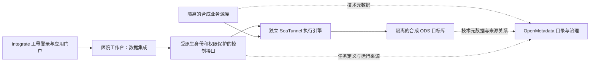

# 医院数据集成层：首条合成数据链路建设方案

日期：2026-10-09。状态：用户已确认方案 A 并批准开始实现；部署与验证结果另行记录。

## 已确认的边界

用户要求开始配套数据集成引擎建设，首条链路明确选择隔离的合成数据。既有产品记录已列出后续 SeaTunnel 与 Doris 建设方向；当前子阶段先完成执行引擎和可操作的同步闭环，分析存储层继续作为后续独立阶段。既有 Integrate 工号登录、医院视觉、中文界面和 K8s 测试部署要求继续适用；界面采用已确认的直接代码方式。

业务系统的数据库本身已有表、字段类型、键和注释等技术元数据。中台集中采集这些元数据，并补充业务定义、标准、来源和血缘。新集成层搬运业务记录；OpenMetadata 保存目录、治理信息和控制元数据，不作为医院业务数据仓库。

## 方案比较

| 方案 | 适配方式 | 取舍 |
|---|---|---|
| A：SeaTunnel + 现有医院工作台（推荐） | 独立执行引擎，现有工作台增加集成入口与少量控制 API | 复用 Integrate 会话与原生权限；需要维护范围受控的任务配置、状态转换与引擎适配代码 |
| B：SeaTunnel + SeaTunnel Web | 改造现有 Web 控制台并单独接入门户身份 | 有现成界面，但官方仍标为实验项目，已发布 Web 与最新引擎不能直接假定兼容 |
| C：SeaTunnel + DolphinScheduler | 引擎执行同步，调度平台负责跨任务依赖与补数 | 适合后续复杂调度；首条链路增加了独立平台、权限和运维组件 |

推荐 A，保持运行时独立，界面和访问控制接入现有医院工作台。对执行器的依赖封装在适配边界，避免把 SeaTunnel 内部代码并入 OpenMetadata 核心实体。

## 推荐架构

SeaTunnel 候选版本固定为截至本日已发布的 3.0.0。上线测试前必须核对发行包校验和、JVM 运行兼容性、实际 REST 行为以及随镜像构建的 PostgreSQL/JDBC/CDC 连接器，禁止使用浮动 `latest`。连接器能力以本次实际验证为准。

测试运行时采用独立的引擎 StatefulSet、ClusterIP 服务和持久化状态卷。合成源与合成目标使用新的 PostgreSQL 实例、凭据和数据卷；不使用现有治理数据库作为业务目标。原始引擎 REST API 仅在集群内开放。数据库密码和客户端凭据通过 Kubernetes Secret 注入；前端仅使用逻辑连接标识，不接收引擎请求中的明文凭据。

## 本子阶段的可交付行为

1. 数据源：展示明确标注的“合成业务源”和“合成 ODS 目标”，测试连接，读取可用表和字段。首期只开放实际验证的 PostgreSQL 链路，不将 Oracle、SQL Server 等尚未测试的连接器标为可用。
2. 任务配置：选择源表、目标表与字段映射，保存技术名称及中文显示名称，先验证配置，再提交执行。只接受受控配置；浏览器不能直接提交任意执行脚本或原始引擎配置。
3. 执行与状态：执行全量同步，查询引擎真实状态和可用指标，展示已脱敏错误，支持停止和失败后的显式重试。提交超时时先用稳定任务标识核对引擎结果，不能盲目重复提交。
4. 增量验证：使用独立测试源的逻辑复制验证 CDC 的新增、更新和删除；停止与恢复行为按实际 checkpoint/savepoint 支持实现并验证。未验证前不显示“恢复成功”或“恰好一次”保证。
5. 治理联动：将验证源表、目标表和对应任务登记到目录，展示来源关系；元数据采集与血缘写入使用原生 API 或官方采集框架，保留可重试的同步状态。任务数据传输成功和目录同步成功分别展示。
6. 工作台入口：中文任务列表、创建/编辑、运行详情和日志/错误状态，复用现有 Integrate 登录与医院原生组件。首期执行控制限定管理员；未授权用户不能通过隐藏按钮之外的方式调用控制接口。

控制元数据只保存任务定义、逻辑连接引用、执行标识、状态与审计信息。业务记录只进入独立目标库。日志与接口响应不得回传连接密码、原始凭据配置或员工源会话。

## 合成验证与验收

使用显式合成的就诊事件数据：`visit_id`、`department_code`、`visit_type`、`updated_at`。首批 100 行；增量插入 20 行、更新 10 行、删除 5 行，最终应为 115 行。除了计数，还按主键逐项核对字段值，确认更新和删除已生效。

- 全量：引擎实际完成源到目标的数据传输，目标记录与源记录匹配。
- CDC：初始快照与连续变更均可核对；重复执行或恢复不能产生重复主键记录。
- 故障：无效连接、错误字段映射、引擎不可达、提交结果不确定和停止失败显示真实结果；恢复前保留任务定义。
- 权限：未登录、普通员工和管理员按原生权限分别验证；不伪造真实员工会话。实际员工门户操作验收单独说明。
- 治理：目录中的源/目标结构与验证表一致，任务与来源关系可查询；目录同步异常不伪装为数据传输失败。
- 发布：镜像及插件版本固定，配置无明文凭据，K8s 服务端校验、实际运行和资源核对通过；提供仅移除本次新增组件的回退方式。

合成数据上的成功不代表真实 HIS/LIS 的版本兼容性、生产负载能力、源库权限或 CDC 日志配置已经验收。实际业务库接入在收到类型、版本及合法测试连接后另行验证。

## 已核对的依据

- [项目既有产品记录](../../PRODUCT.md)：后续方向包含 SeaTunnel 与 Doris；沿用医院身份与视觉要求。
- [Apache 官方下载页](https://seatunnel.apache.org/download/)：3.0.0 发布日期为 2026-09-29；SeaTunnel Web 的已发布版本为 1.0.2，并明确标注实验状态。
- [SeaTunnel 3.0 REST API](https://seatunnel.apache.org/docs/3.0.0/engines/zeta/rest-api-v2/)：提供提交、查询、停止及恢复相关接口；控制层仍需核对安装版本的真实响应。
- [PostgreSQL CDC](https://seatunnel.apache.org/docs/3.0.0/connectors/source/PostgreSQL-CDC/) 与 [PostgreSQL Sink](https://seatunnel.apache.org/docs/3.0.0/connectors/sink/PostgreSql/)：作为首条增量链路的候选连接器依据。
- [Kubernetes 部署](https://seatunnel.apache.org/zh-CN/docs/3.0.0/getting-started/kubernetes/)：集群模式推荐 StatefulSet，运行状态与连接器应按固定版本持久化配置。
- [DolphinScheduler](https://dolphinscheduler.apache.org/)：可作为后续复杂调度阶段的候选，首期不默认新增该平台。

## 当前进度

- [x] 核对当前部署，确认尚无业务数据集成执行器。
- [x] 用户确认先使用隔离的合成数据验证。
- [x] 核对最新官方发行与 Web 实验状态，提出三种具体方案。
- [x] 用户确认方案 A、控制层接入位置与首期功能范围，并批准开始实现。
- [x] 完成执行计划、实现、测试部署和证据记录；结果见[独立验证记录](data-integration-verification.md)，真实员工操作验收仍单独保留。

设计方案已经用户批准并进入实施；新增引擎、两侧合成数据库、专用网络策略和工作台控制扩展。2026-10-09 用户进一步明确整个服务仅需 PC 展示，最终界面验收按桌面范围执行。实施与验证结果见 [验证记录](data-integration-verification.md)，运行与回退见 [运维说明](data-integration-operations.md)。
